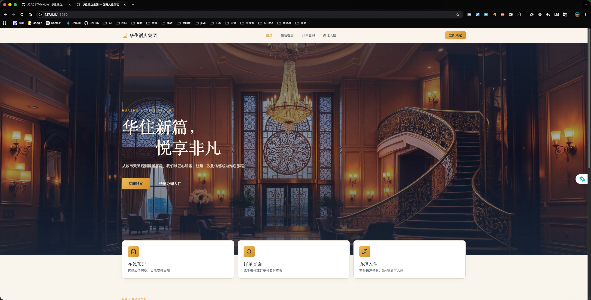
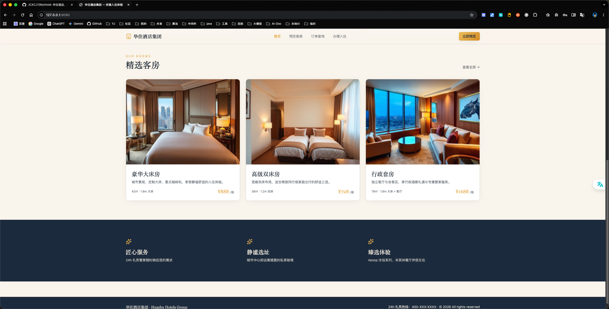
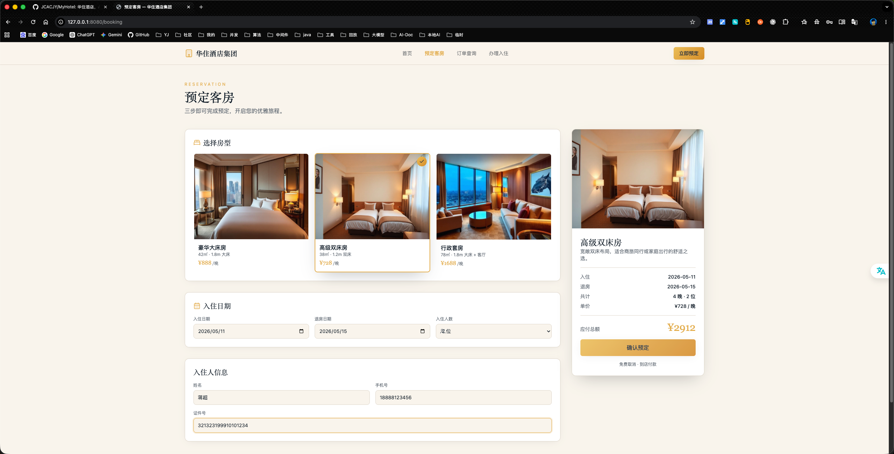
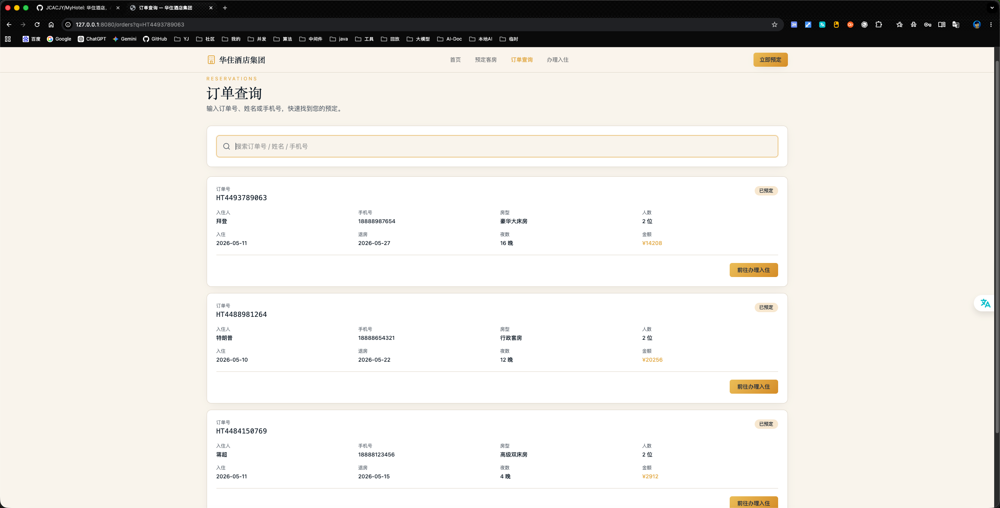
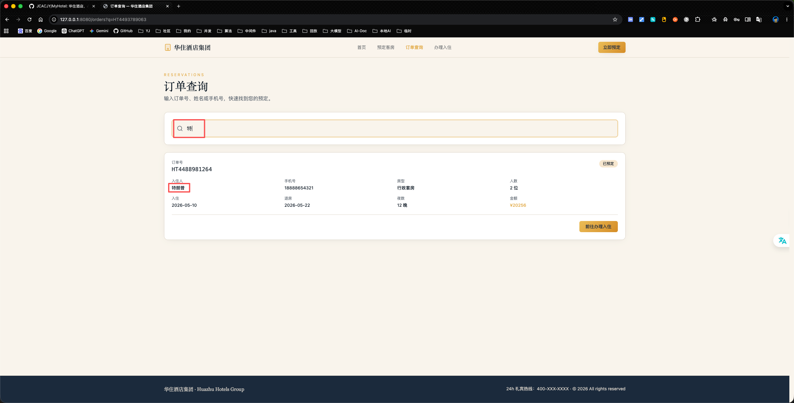
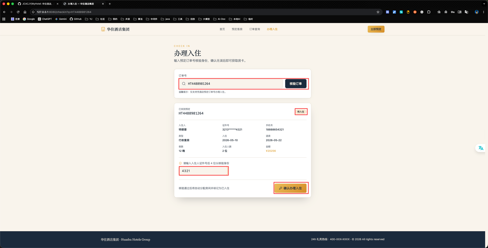
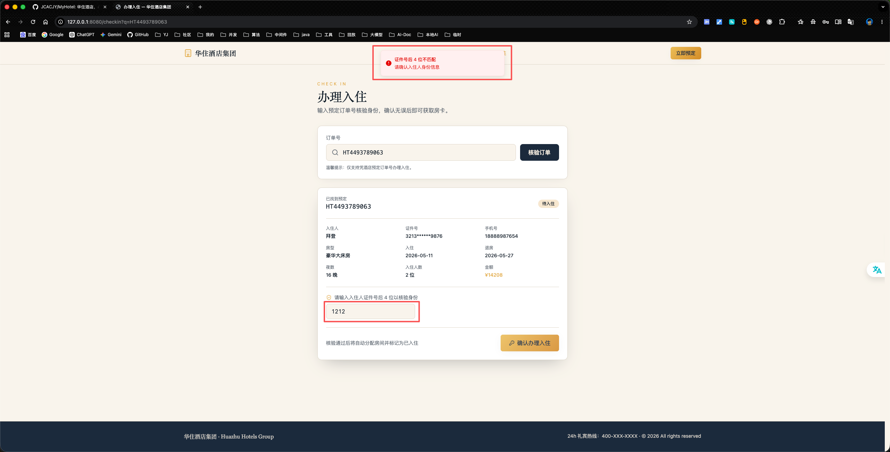
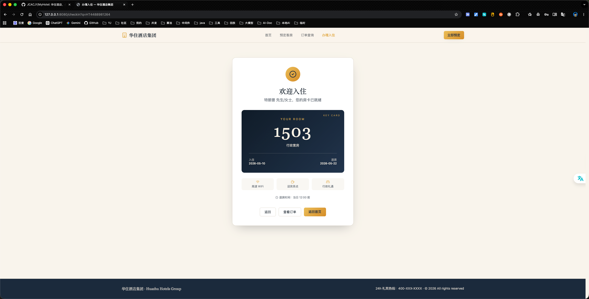
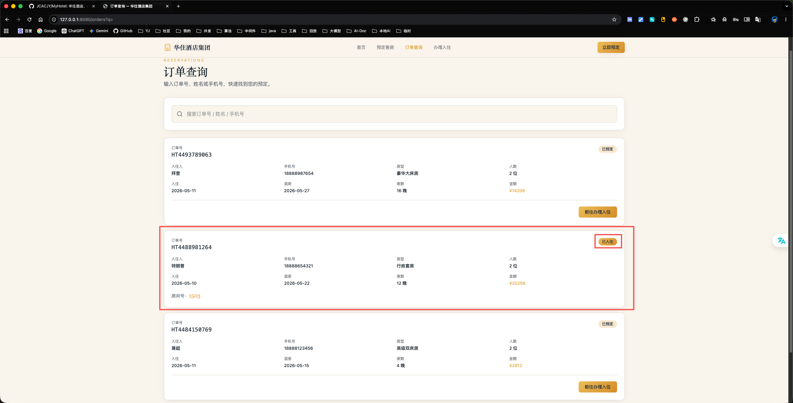

# 华住酒店管理系统

MyHotel 是一个前后端分离的酒店管理系统示例项目。前端基于 React/Vite，后端基于 Java 17、Spring Boot 3.5、Spring MVC 和 MyBatis-Plus，默认使用 H2 内存数据库，生产环境可切换到 MySQL。

---

## 核心功能

- 首页客房展示
- 预定客房
- 订单查询
- 办理入住

---

## 环境要求

- JDK 17
- Node.js 20+
- Maven Wrapper：项目已包含 `mvnw`，无需单独安装 Maven

---

## 快速开始

请使用以下命令将项目克隆至本地，并进入项目根目录：

```bash
git clone https://github.com/JCACJY/MyHotel.git
cd ./MyHotel
```

下面提供了两种启动方式，任选其一即可：
- [本地启动](#①本地启动)
- [Docker容器启动](#②Docker容器启动)

### ①本地启动

Step1、在项目根目录执行：

```bash
export JAVA_HOME=$(/usr/libexec/java_home -v 17)

./mvnw test

cd src/main/webapp
npm install
npm run build
cd -
```

Step2、启动后端服务：

```bash
# 注意：确保在项目根目录下执行
export JAVA_HOME=$(/usr/libexec/java_home -v 17)
./mvnw spring-boot:run
```

Step3、另开一个终端启动前端开发服务：

```bash
# 注意：确保在项目根目录下执行
cd src/main/webapp
npm run dev -- --host 127.0.0.1 --port 8080
```

Step4、浏览器访问：

```text
http://localhost:8080/
```

---

### ②Docker容器启动

Step1、构建镜像：

```bash
docker build -t myhotel:latest .
```

Step2、启动容器：

```bash
docker run --rm -p 8080:8080 --name myhotel myhotel:latest
```

Step3、浏览器访问：

```text
http://localhost:8080/
```

---

## 功能演示

- ### 首页
 


- ### 预定


- ### 订单列表

- ### 订单搜索


- ### 办理入住

- ### 身份核验

- ### 入住成功

- ### 已入住

